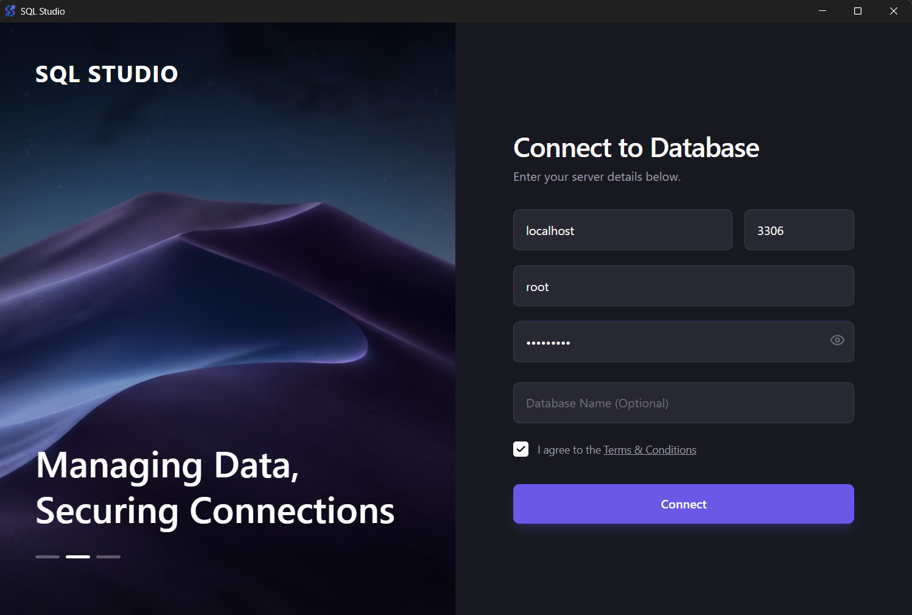
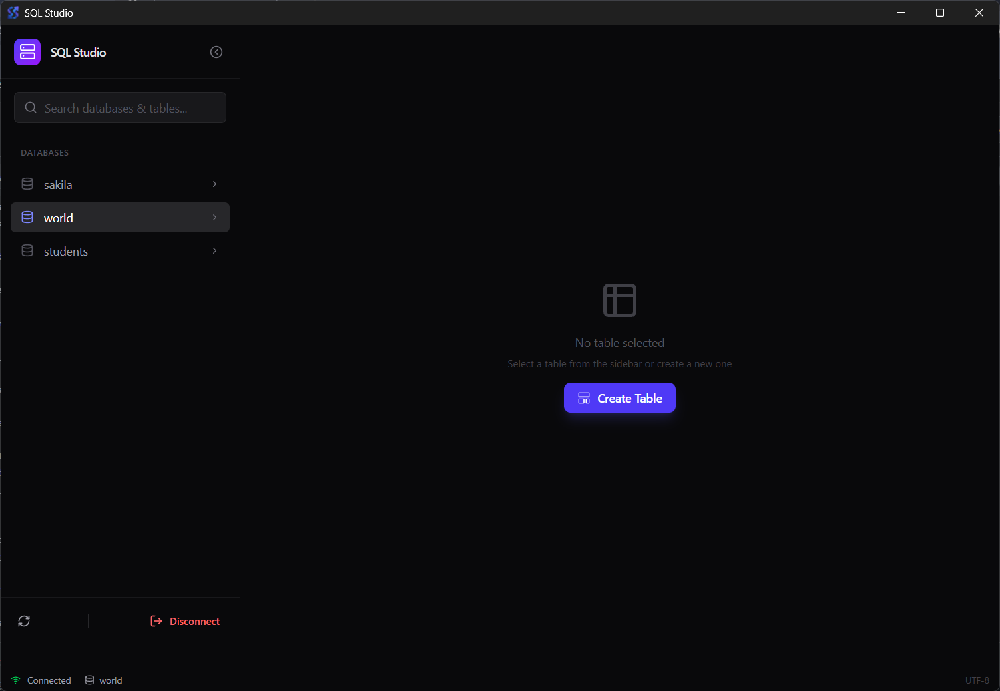
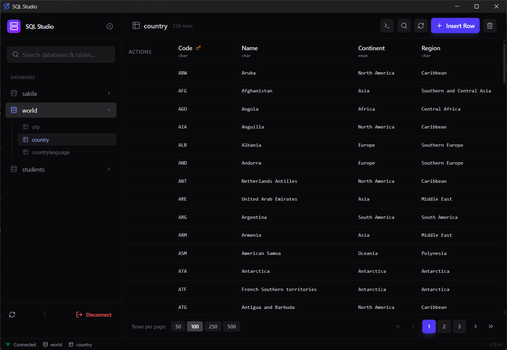
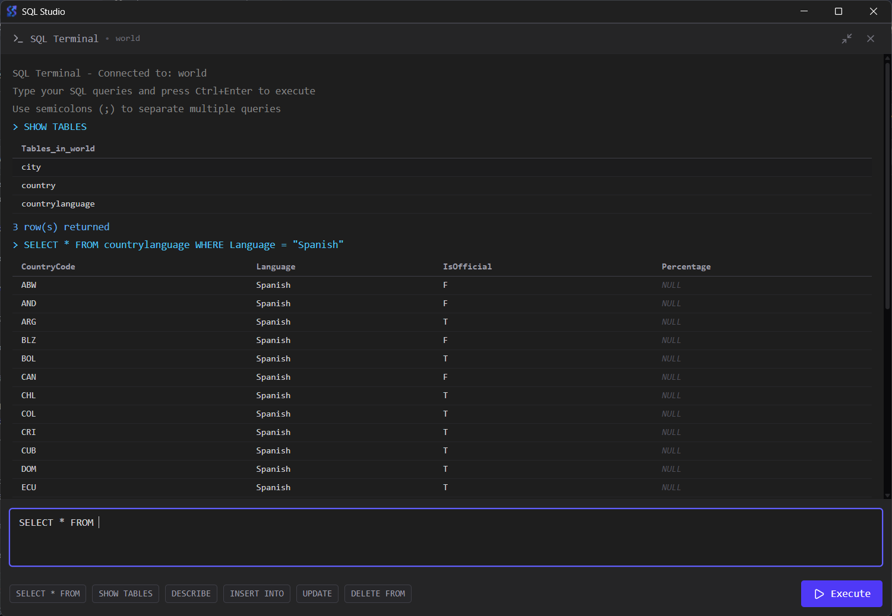

# SQL Studio

   

**SQL Studio** is a powerful, user-friendly desktop application developed by [techXcelerate](https://ntxm.org) (ntxm.org) designed to simplify database management for professionals and teams working with offline SQL databases. Built with a focus on security, performance, and an intuitive visual interface, SQL Studio allows you to visualize, query, and perform all CRUD (Create, Read, Update, Delete) operations without writing repetitive SQL code manually.

Whether you're a database administrator, data analyst, or developer, SQL Studio provides a beautiful and advanced UI to explore databases, manage tables, and manipulate data efficiently—all in a secure, offline environment.

> **Note**: This software is proprietary and provided under a private license. You may download and use SQL Studio for personal or internal business purposes, but you are not permitted to modify, redistribute, or reverse-engineer the software without explicit written permission from (ntxm.org). All rights reserved.

## Key Features

- **Intuitive Connection Management**: Easily connect to your MySQL databases with secure credentials handling. Supports host, port, user, password, and optional database selection.
- **Database and Table Explorer**: Browse databases, tables, and schemas in a clean sidebar view. Select and switch between databases seamlessly.
- **Visual Table Viewer**: View table structures, columns, and data in a responsive grid. Supports pagination for large datasets.
- **CRUD Operations Made Simple**:
  - **Create**: Add new tables with custom columns or insert rows directly.
  - **Read**: Search, filter, and view data with ease.
  - **Update**: Edit rows inline and save changes instantly.
  - **Delete**: Remove rows or drop entire tables with confirmation prompts.
- **SQL Terminal**: Execute custom SQL queries or multiple queries in a dedicated terminal window. View results in real-time.
- **Data Search and Filtering**: Quickly search table data with dynamic queries.
- **Refresh and Sync**: One-click refresh to update database and table views.
- **Secure and Offline-First**: All operations run locally on your machine—no cloud dependencies. Connections use TLS for added security.
- **Modern UI**: Built with a dark-themed, responsive design for a premium user experience. Includes loading indicators, toasts for feedback, and animations for smooth interactions.
- **Cross-Platform Support**: Available for Windows only (preparing for macOS).

SQL Studio solves the common pain points of traditional CLI tools or bulky IDEs by offering a lightweight, focused interface that's beautiful and efficient for everyday database tasks.

## Screenshots

### Connection Panel

Connect to your database with ease:

### Database and Table Browser

Explore databases and tables in the sidebar, with data views in the main panel:

### Table Data View

View, edit, and manage table data:

### SQL Terminal

Run custom queries:

For more visuals, check out the [releases page](https://github.com/techxcelerate/sql-studio/releases) or download the app to experience it firsthand.

## Installation

SQL Studio is available as pre-built binaries for easy installation. Download the latest version from the [GitHub Releases page](https://github.com/techxcelerate/sql-studio/releases).

1. Go to [releases](https://github.com/techxcelerate/sql-studio/releases).
2. Select the latest release (e.g., v0.0.1).
3. Download the installer for your platform:
   - **Windows**: `SQL.Studio_0.0.1_x64_en-US.msi`
   - **macOS**: (not available till now)
   - **Linux**: (not available till now)
4. Run the installer and follow the on-screen instructions.
5. Launch SQL Studio from your applications menu.

No additional setup is required—start connecting to your databases right away!

## Getting Started

1. **Launch the App**: Open SQL Studio. You'll see the Connection Panel.
2. **Connect to a Database/Connection**:
   - Enter your MySQL server details (host, port, user, password, optional database).
   - Click "Connect". Upon success, you'll see a list of available databases in the sidebar.
3. **Select a Database**: Click on a database to load its tables.
4. **Work with Tables**:
   - Select a table to view its data and structure.
   - Use the toolbar to insert rows, delete rows, update data, or create new tables.
   - Search data using the search bar.
5. **Open SQL Terminal**: From the table view, toggle the terminal to run custom queries.
6. **Disconnect**: Use the sidebar menu to disconnect when done.

For detailed in-app guidance, refer to tooltips and status messages.

If you encounter issues, visit the [GitHub Issues page](https://github.com/techxcelerate/sql-studio/issues) to report them (include screenshots and steps to reproduce).

## Updates and Releases

We regularly release updates to improve features, fix bugs, and enhance performance. Check the [releases page](https://github.com/techxcelerate/sql-studio/releases) for the latest version and changelog.

- **Current Version**: 0.0.1 (Initial release with core CRUD and terminal features).
- **Upcoming Features**: Export/import data, query history, advanced filtering, and multi-connection support.

## Privacy and Security

SQL Studio processes all data locally on your device. No data is sent to external servers. For our full privacy policy, see [Privacy](privacy.md) (or the in-app link).

## License

© techXcelerate by ntxm.org. All rights reserved.

This software is proprietary. Unauthorized copying, modification, distribution, or use is strictly prohibited. For licensing inquiries or permissions, contact us at [support@ntxm.org](mailto:support@ntxm.org).

## Contact

- **Website**: [ntxm.org](https://ntxm.org)
- **Support**: [contact@ntxm.org](mailto:contact@ntxm.org)
- **GitHub Repo**: [techxcelerate/sql-studio](https://github.com/techxcelerate/sql-studio) (for releases and issues only; source code is not open for contributions)

Thank you for using SQL Studio! If you find it valuable, share your feedback - We appreciate it.
