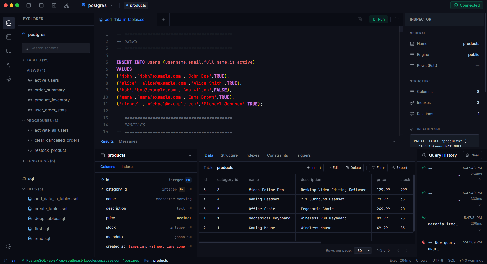
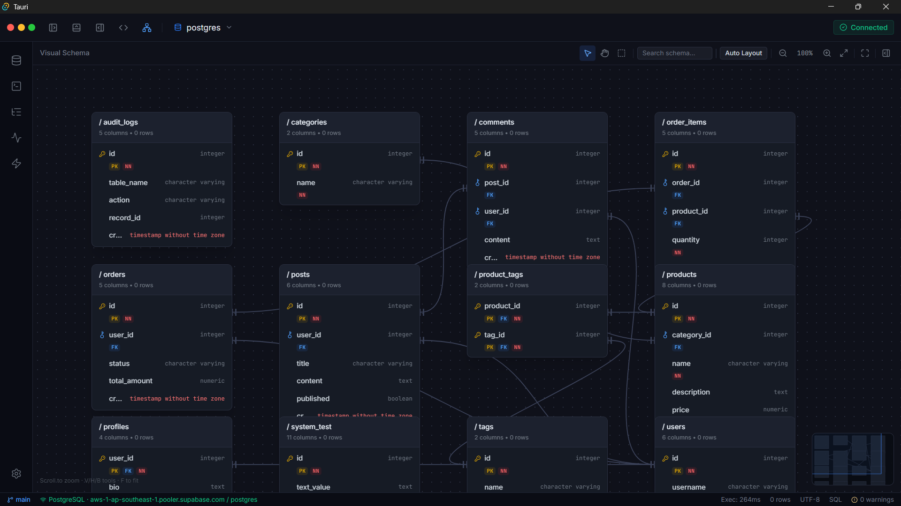
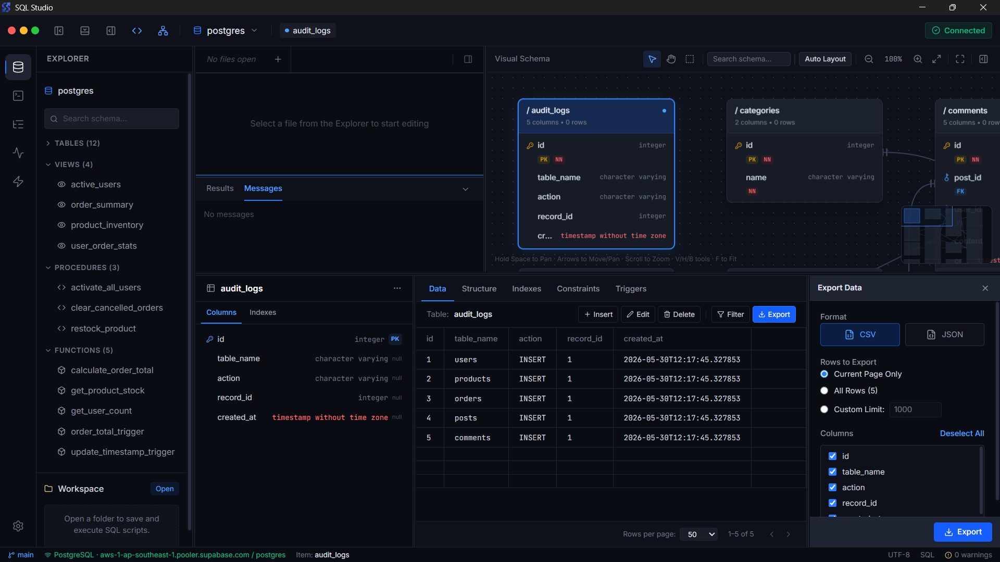

# SQL Studio

   
   <h3>SQL Studio</h3>
   

      
   

**SQL Studio** is a powerful, cross-platform database management application developed by **[nitiksh](https://nitiksh.ntxm.org)** at **[ntxm (techXcelerate)](https://ntxm.org)**. Designed to simplify database management for professionals and teams, SQL Studio provides an advanced, visually stunning, and highly intuitive graphical interface to visualize, query, and perform all operations on your databases without writing repetitive SQL code manually.

Built with Tauri, Rust, and React, SQL Studio runs natively on **Windows, macOS, and Linux**, offering incredible performance and a deeply integrated OS experience.

## Key Features

- **Multi-Database Support**: Connect seamlessly to PostgreSQL, MySQL, and SQLite databases from a single unified connection hub.
- **Visual Schema Builder**: Automatically generate and interact with an interactive Entity-Relationship (ER) diagram of your database. Understand complex relationships at a glance.
- **Advanced Query Editor**: Write SQL scripts with syntax highlighting, auto-completion, and multi-tab support.
- **Powerful Data Panel**: View, insert, edit, delete, and easily filter table data using a beautiful spreadsheet-like interface. 
- **Intelligent Export**: Export your table data or query results directly to CSV or JSON formats using a native OS file dialog.
- **Cross-Platform**: Available on Windows, macOS, and Linux, ensuring a consistent and premium experience across all your devices.

## Screenshots

### Connection Hub
Easily manage your recent connections, connect to new databases, or open local SQLite files.

### Main Workspace
A rich, split-pane workspace featuring an explorer, advanced SQL editor, interactive data panel, schema inspector, and query history.

### Visual Schema
Explore your database architecture with an interactive, auto-layout node-based Entity-Relationship diagram.

### Advanced Data Export & Filtering
Dynamically filter rows and export precisely the data you need to CSV or JSON with a few clicks.

## License

> **Note**: This software is proprietary and provided under a private license by **[ntxm (techXcelerate)](https://ntxm.org)**. You may download and use SQL Studio for personal or internal business purposes, but you are not permitted to modify, redistribute, or reverse-engineer the software without explicit written permission from the developers. All rights reserved.
