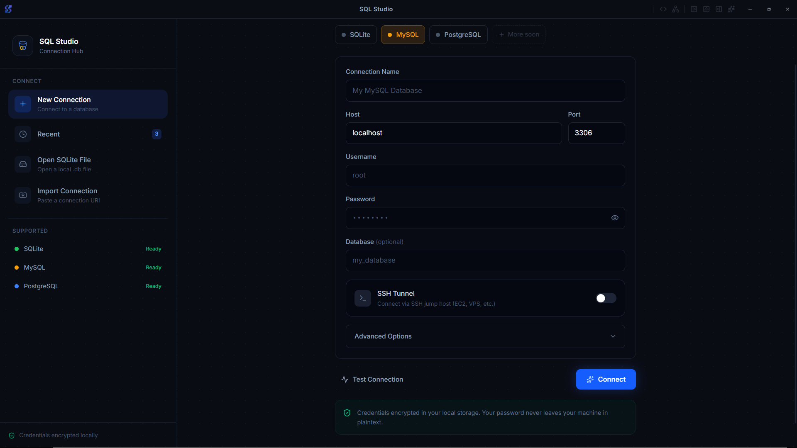
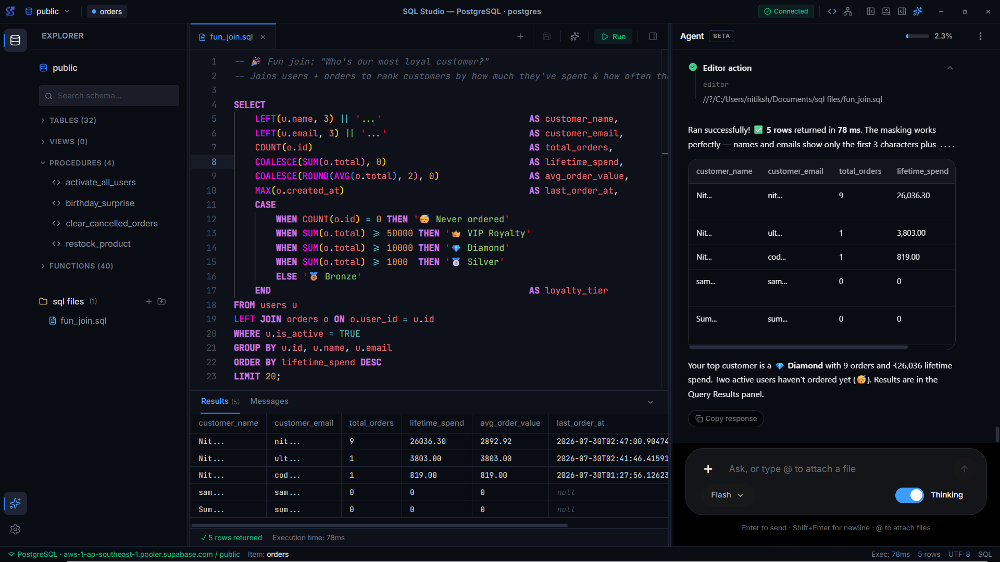
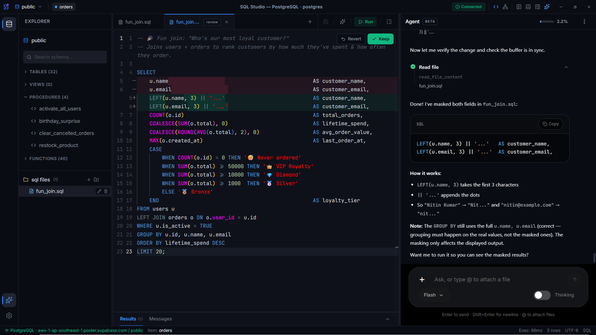
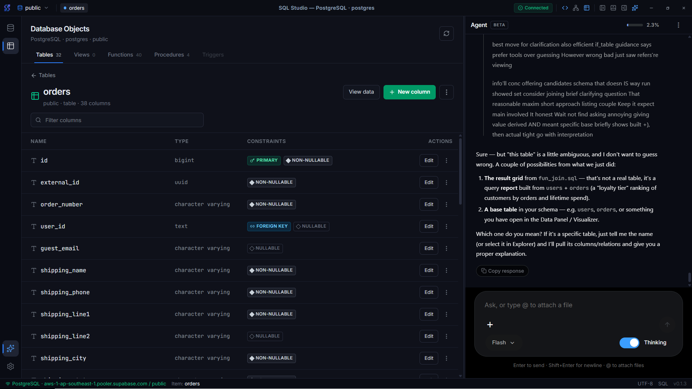
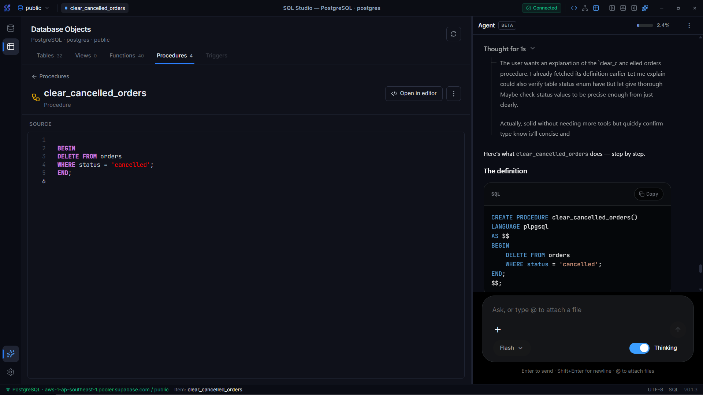
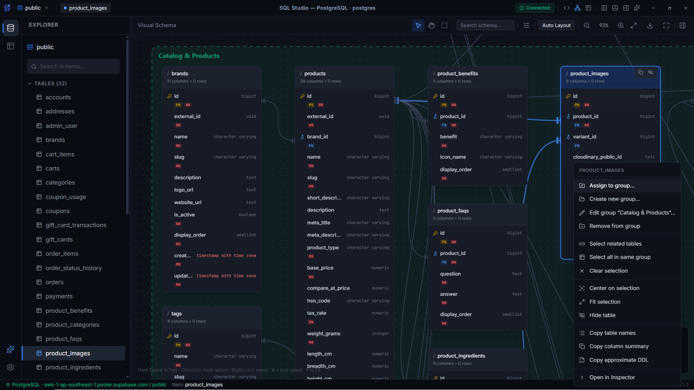

# SQL Studio

### SQL Studio

**v0.1.3** · Local-first desktop SQL IDE · Windows · macOS · Linux

A high-performance database client, query IDE, schema visualizer, and optional DeepSeek agent — built with **Tauri 2**, **Rust**, and **React 19**.

[Download latest release](https://github.com/techxcelerate/sql-studio/releases) · [ntxm.org](https://ntxm.org) · [nitiksh](https://nitiksh.ntxm.org)

`PostgreSQL` · `MySQL` · `SQLite`

---

> [!IMPORTANT]
> **SQL Studio is private / proprietary software — it is not open source.**  
> You may use the **official application free of charge** (personal or commercial).  
> You may redistribute **only the official installer**, unmodified, with **SQL Studio / ntxm** names and branding intact.  
> **Nothing else is allowed** — no source, forks, rebrands, or unofficial builds.  
> Full terms: [LICENSE](./LICENSE).

---

## Screenshots (v0.1.3)

  
   
  <em>Connection Hub — MySQL setup, SSH tunnel, encrypted credentials</em>

  
   
  <em>Monaco editor · query results · Agent BETA summarizing the run</em>

  
   
  <em>Agent file edits with Keep / Revert review in the editor</em>

  
   
  <em>Database Objects — table detail, columns, constraints</em>

  
   
  <em>Database Objects — procedures with Open in editor + Agent explain</em>

  
   
  <em>Schema Visualizer — table groups, relationships, context menu</em>

---

## What is SQL Studio?

**SQL Studio** is a native desktop database IDE from **[ntxm](https://ntxm.org)** / **[nitiksh](https://nitiksh.ntxm.org)**. Connect to your databases, write SQL in Monaco, browse and edit rows, manage views / functions / procedures, explore relationships on a live schema canvas, and optionally use a DeepSeek agent — without sending your data to a cloud IDE.

| Pillar | What you get |
|---|---|
| **Local-first** | Connections, credentials, workspace layout, and history stay on your machine |
| **Native speed** | Tauri + Rust drivers — not a heavyweight web shell |
| **Full IDE surface** | Hub → Explorer · editor · Database Objects · data grid · schema canvas · Agent |
| **Secure by default** | Encrypted credentials, SSH tunnels, scoped filesystem access |
| **Private by design** | No product telemetry. Optional AI uses *your* DeepSeek key only when enabled |

---

## Features

### Connection Hub

- **PostgreSQL**, **MySQL** (MariaDB-compatible), and **SQLite** in one place
- Test connection with server version + latency before saving
- Recent connections from the encrypted store
- Quick **Open SQLite file** (WAL + foreign keys on connect)
- **Import** `postgres://` / `mysql://` / SQLite path or URI into the form
- Optional **SSH tunnel** (password or private key) with known-hosts TOFU
- SSL modes: `disable` · `prefer` · `require`

### Workspace & Explorer

- Layout, tabs, and canvas state remembered **per connection / database**
- Schema browser: **Tables · Views · Procedures · Functions**
- Open a workspace folder; create, rename, delete, and open SQL files
- Virtual tabs (`virtual://…`) for scratch queries and object SQL
- Autosave + recovery for unsaved work

### Database Objects (new in the 0.1.x line)

- Keep-alive workspace: **Tables · Views · Functions · Procedures** (Triggers coming later)
- Table designer / column detail with View data
- View & routine source in Monaco; **Open in editor**; Drop where supported
- Selection synced with the Explorer sidebar

### Monaco SQL Editor

- VS Code–class editing: highlighting, multi-cursor, format, run
- Schema-aware completions from live introspection
- Multi-tab files and an integrated results strip
- **Keep / Revert** when the agent proposes file or `virtual://` object edits
- Ask Agent from editor problem markers

### Schema Visualizer

- Interactive ER-style canvas: pan, zoom, multi-select, hide, fit
- Auto-layout that respects relationships and **table groups**
- Color-coded groups with an IDE-style context menu
- Export diagram as **PNG** or **SVG**
- Jump to the **Inspector** for columns, indexes, constraints, and approximate DDL

### Data Browser

- Virtualized grid with pagination and row selection
- Visual **filters** (AND rules, rich operators)
- **Insert / Edit / Delete** with primary-key aware SQL
- **Export** page / all / custom limit as **CSV** or **JSON**
- Side tools: History · Filter · Export · Insert · Edit · Delete

### DeepSeek Agent (optional)

- Streaming agent for schema, SQL, explorer, canvas, objects, and data workflows
- Scoped to the **current database** (no silent cross-DB hopping)
- Permission modes: `readonly` (default) · `ask` · `allowlist`
- Edits workspace `.sql` files and open `virtual://` object tabs with Keep / Revert
- Requires your own DeepSeek API key (stored encrypted). Traffic goes to DeepSeek only when you use the agent — not to ntxm servers.

### Desktop chrome

- Custom titlebar and resizable IDE panels
- Activity rail: **Explorer · Database Objects · Agent · Settings**
- Status bar: connection, SSH, timing, **v0.1.3**

---

## Security & privacy

| Layer | Detail |
|---|---|
| **Credentials** | AES-256-GCM at rest; random IV per record; OS-protected key file |
| **SSH** | Jump host support; password or key; first-connect known-hosts (TOFU) |
| **TLS to DB** | `ssl_mode` passed to the driver (`disable` / `prefer` / `require`) |
| **Filesystem** | App data by default; workspace folders granted after you open them |
| **Agent SQL** | Parser-based read-only checks + database-scope rules |
| **Telemetry** | None from the product core |

---

## Download & install

1. Open **[Releases](https://github.com/techxcelerate/sql-studio/releases)**
2. Get the **official** installer for your OS (Windows / macOS / Linux)
3. Install, launch **SQL Studio**, and connect from the Hub

| | |
|---|---|
| **Product** | SQL Studio |
| **Version** | **0.1.3** |
| **Platforms** | Windows · macOS · Linux |
| **Engines** | PostgreSQL · MySQL · SQLite |
| **Stack** | Tauri 2 · Rust · React 19 · Monaco |

Only **official** installers published by the copyright holder may be redistributed — unmodified, with product name and branding intact. Nothing else may be redistributed.

---

## What’s in / out of v0.1.3

**Shipped**

- Multi-engine hub, SSH, encrypted saved connections  
- Monaco editor + schema intelligence + Ask Agent from markers  
- **Database Objects** (tables / views / functions / procedures)  
- Agent Keep / Revert on workspace files and `virtual://` object SQL  
- Schema canvas with groups & PNG/SVG export  
- Data grid with filter / CRUD / CSV·JSON export  
- DeepSeek agent (optional)  
- Workspace persistence & Explorer polish  

**Not shipped yet** (don’t expect these)

- Extra database engines beyond the three above  
- Triggers introspection  
- Auto-deploy of object DDL to the live DB after Keep  
- SQL dump / INSERT export (CSV + JSON only)  
- Schema PDF / SQL diagram export  
- Non-DeepSeek AI providers  

---

## License

**SQL Studio Proprietary License** (private) — see [LICENSE](./LICENSE)

Copyright © 2024–2026 **ntxm** / **nitiksh**. All rights reserved.

| You may | You may not (in any case, without prior written permission) |
|---|---|
| Use the official app free (personal or commercial) | Copy, publish, or redistribute the **source** |
| Redistribute the **official installer only**, unmodified, with **SQL Studio / ntxm** branding intact | Modify, rebrand, or ship unofficial packages |
| | Fork or create derivatives from the source |
| | Reverse-engineer binaries beyond what the law requires |
| | Remove copyright / attribution or sell unofficial builds |

**Nothing else is licensed.** Provided **“AS IS”**, without warranty. Written exceptions only: [ntxm.org](https://ntxm.org).

> [!WARNING]
> A public GitHub page does **not** make this open source. Terms in [LICENSE](./LICENSE) control.

---

## Credits

| | |
|---|---|
| **Product** | SQL Studio |
| **Studio** | [ntxm](https://ntxm.org) |
| **Author** | [nitiksh](https://nitiksh.ntxm.org) |
| **Releases** | [github.com/techxcelerate/sql-studio/releases](https://github.com/techxcelerate/sql-studio/releases) |

---

**SQL Studio** · v0.1.3 · Proprietary · Local-first

[Download](https://github.com/techxcelerate/sql-studio/releases) · [License](./LICENSE) · [ntxm.org](https://ntxm.org)

